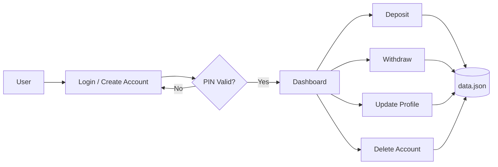

<div align="center">


<a href="https://git.io/typing-svg">
  
</a>

<br/>

<p>
  
  
  
  
</p>

<p>
  <a href="https://bank-management-salik.streamlit.app/">
    
  </a>
</p>

</div>

<br/>

## 📌 Overview

**World Bank Management System** is a full-featured banking application combining secure authentication, real-time transactions, and a modern UI. Built with Python OOP and Streamlit, it delivers a polished banking experience with PIN-based security, live balance updates, and full account management — all backed by a lightweight JSON database.

> Designed as a practical demonstration of clean OOP architecture paired with a production-style Streamlit front end — no heavy framework, no external database, fully self-contained.

<br/>

## ✨ Features

<table>
<tr>
<td width="50%" valign="top">

### 🔐 Security
- PIN-based authentication (4-digit)
- Session-based access control
- Input validation on every transaction
- Confirmed, irreversible account deletion

</td>
<td width="50%" valign="top">

### 💰 Transactions
- Deposit funds ($1 – $10,000 per transaction)
- Withdraw with live balance validation
- Instant balance updates on the dashboard
- Transaction limits to prevent abuse

</td>
</tr>
<tr>
<td width="50%" valign="top">

### 👤 Account Management
- Unique account number on signup
- Create / view / update / delete account
- Editable name, email, and PIN
- Persistent JSON-backed storage

</td>
<td width="50%" valign="top">

### 📊 Dashboard & UI
- Real-time balance & account metrics
- Quick-action shortcuts
- Dark glassmorphism theme
- Fully responsive layout with animations

</td>
</tr>
</table>

<br/>

## 🧱 System Architecture



<br/>

## 🛠️ Tech Stack

<p>
  
  
  
  
  
  
</p>

**OOP principles applied:** Encapsulation · Inheritance · Polymorphism · Abstraction

<br/>

## 📁 Project Structure

```
Bank-Management-System/
├── app.py                  # Main Streamlit application
├── Bank Management.py      # Core OOP implementation
├── data.json                # JSON database (auto-generated)
├── requirements.txt
└── README.md
```

<br/>

## 🔧 Installation

```bash
git clone https://github.com/SalikAhmad702/Bank-Management-System.git
cd Bank-Management-System

python -m venv venv

# Windows
venv\Scripts\activate
# macOS/Linux
source venv/bin/activate

pip install -r requirements.txt
streamlit run app.py
```

**requirements.txt**
```
streamlit==1.28.0
plotly==5.17.0
pandas==2.0.3
streamlit-option-menu==0.3.6
Pillow==10.1.0
```

<br/>

## 📖 Usage

| Action | Steps |
|---|---|
| **Create Account** | Sidebar → fill details → save your account number → log in |
| **Deposit** | Login → Deposit → enter PIN + amount → confirm |
| **Withdraw** | Login → Withdraw → enter PIN + amount → system validates balance |
| **Update Profile** | My Details → Update → change name, email, or PIN |
| **Delete Account** | Delete Account → enter PIN → type `DELETE` to confirm |

<br/>

## 📊 API Reference

| Method | Parameters | Returns | Description |
|---|---|---|---|
| `create_account` | name, age, email, pin | `(bool, str)` | Creates a new account |
| `deposit_money` | account_no, pin, amount | `(bool, str)` | Deposits funds |
| `withdraw_money` | account_no, pin, amount | `(bool, str)` | Withdraws funds |
| `get_user_details` | account_no, pin | `(dict, str)` | Retrieves user info |
| `update_details` | account_no, pin, name, email, new_pin | `(bool, str)` | Updates profile |
| `delete_account` | account_no, pin | `(bool, str)` | Deletes account |

**Sample record (`data.json`)**
```json
{
  "name": "John Doe",
  "age": 25,
  "email": "john@example.com",
  "pin": 1234,
  "accountNo": "AbC12!3",
  "balance": 5000
}
```

<br/>

## 🗺️ Roadmap

- [x] Account creation & PIN auth
- [x] Deposit / withdraw
- [x] Profile management & dashboard
- [ ] Transaction history
- [ ] Email notifications & PDF statements
- [ ] Interest calculation & multiple account types
- [ ] PostgreSQL migration + Docker deployment
- [ ] Two-factor authentication

<br/>

## 🤝 Contributing

Contributions are welcome — especially transaction history, encryption, and unit tests.

```bash
git checkout -b feature/your-improvement
git commit -m "feat: describe your change"
git push origin feature/your-improvement
```
Then open a pull request.

<br/>

## 📄 License

This project is **free and open source** — no license restrictions.

- ✅ Free to use, modify, and distribute
- ✅ Free for personal, academic, and commercial use
- ✅ No attribution required
- ⚠️ Provided "as-is" without warranty

---


## 📧 Lets Connect

<div align="center">

<h3>Built with obsession by <b>Salik Ahmad</b> 🏦</h3>

<p>
  <a href="https://salikahmad.vercel.app/" target="_blank">
    
  </a>
  <a href="https://www.linkedin.com/in/salik-ahmad-programmer/" target="_blank">
    
  </a>
  <a href="https://www.kaggle.com/salikahmad702" target="_blank">
    
  </a>
  <a href="https://github.com/SalikAhmad702" target="_blank">
    
  </a>
</p>

<br/>

<a href="https://salikahmad.vercel.app/">
  
</a>

<br/><br/>


</div>
